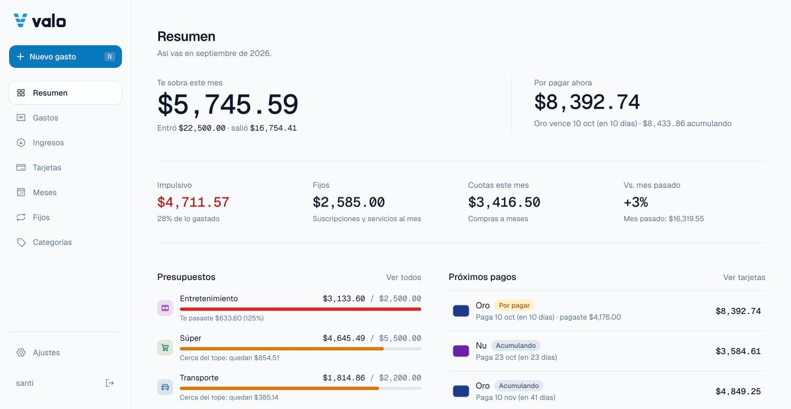
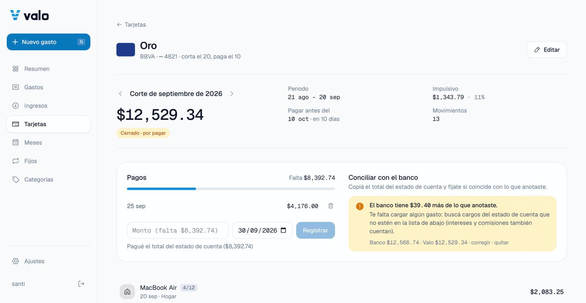
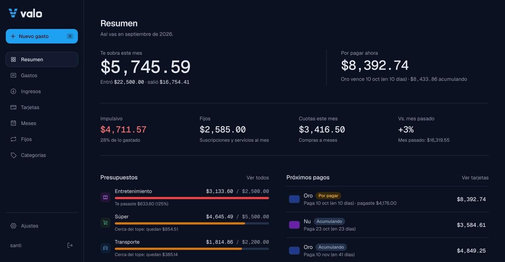
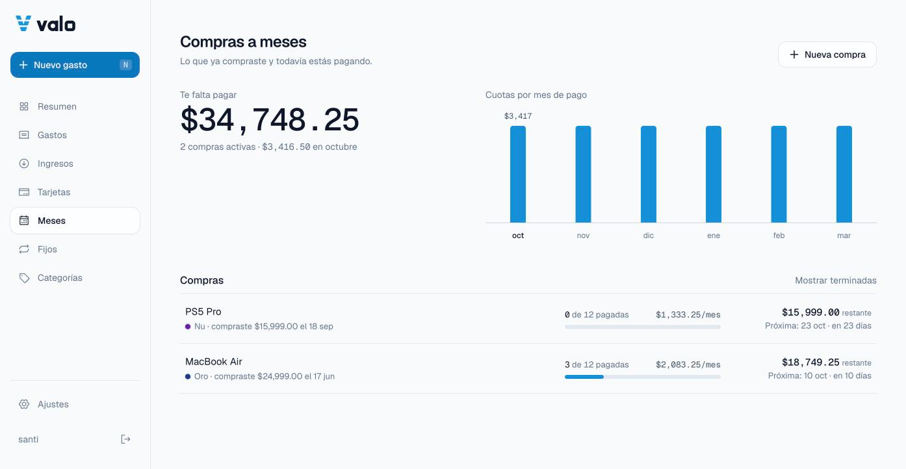
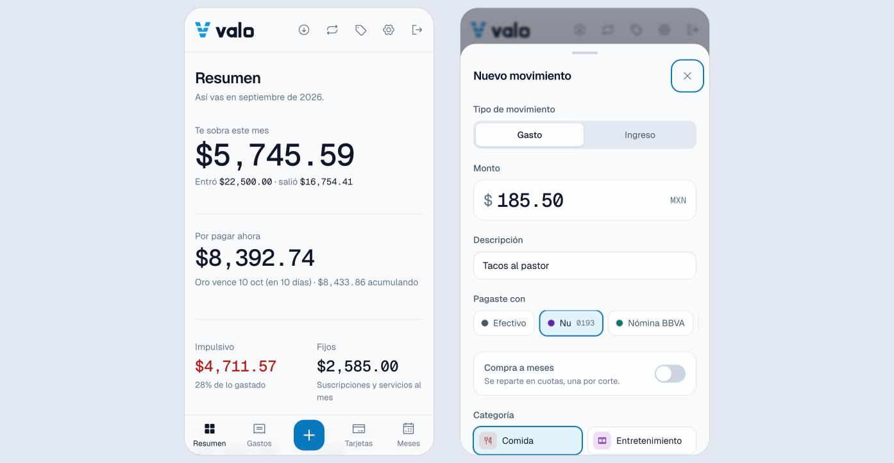
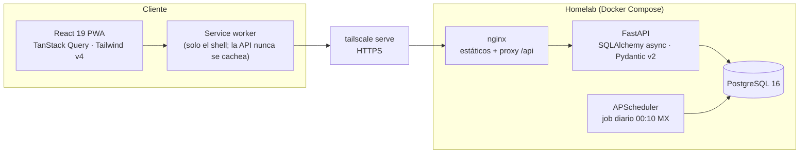

<p align="center">
  
</p>

<p align="center">
  <strong>Que te cuadren las cuentas.</strong><br>
  Finanzas personales self-hosted para quien paga con varias tarjetas y quiere dejar de sorprenderse a fin de mes.
</p>

<p align="center">
  <a href="https://github.com/Santiago-2077/valo/actions/workflows/ci.yml"></a>
  
  
  
</p>



## El problema

Pagaba con dos tarjetas de crédito, débito y efectivo. Cada tarjeta corta un día distinto, las compras a meses aparecen en cortes futuros, las suscripciones se cobran solas y a fin de mes el total del banco nunca coincidía con lo que creía haber gastado.

Valo modela el dinero **como lo hace el banco**: cada gasto cae en el corte correcto según el día de cierre de su tarjeta, las cuotas se reparten en los cortes que vienen, los fijos se anotan solos y, cuando llega el estado de cuenta, la conciliación te dice exactamente cuánto falta o sobra.

## Qué hace

| | |
|---|---|
| **Cortes reales por tarjeta** | Día de corte y de pago por tarjeta; cada gasto sabe en qué resumen cae y cuándo se paga. "Por pagar ahora" vs. lo que se sigue acumulando. |
| **Compras a meses (MSI)** | Una compra a N meses genera N cargos, uno por corte; el redondeo va en la última cuota para que la suma sea exacta. Gráfico de cuánto pagás por mes. |
| **Fijos automáticos** | Suscripciones y servicios (mensual, quincenal, anual) se registran solos con un job diario idempotente; los servicios variables se cargan como estimado. |
| **Ingresos** | Sueldo quincenal automático + ingresos variables. Balance del mes: cuánto te sobra o falta. |
| **Pagos y conciliación** | Registrás lo que pagaste de cada corte; cargás el total del estado de cuenta y Valo te dice si cuadra al centavo o qué revisar. |
| **Presupuestos e impulsivos** | Tope mensual por categoría con estado en texto ("Te pasaste $633"), y marca de gasto impulsivo para ver cuánto se va en eso. |
| **Hecha para el celular** | PWA instalable, carga en dos toques (`N` en escritorio), hoja inferior arrastrable, modo claro y oscuro. |

<table>
  <tr>
    <td></td>
    <td></td>
  </tr>
  <tr>
    <td></td>
    <td></td>
  </tr>
</table>

## Arquitectura



**Decisiones de diseño que vale la pena mirar:**

- **Ciclos de facturación** (`api/app/services/billing.py`): un gasto del día de corte o anterior cae en ese ciclo; días inexistentes se ajustan al fin de mes (corte 31 → 28 de febrero). Un test recorre cada día del año para cada día de corte posible y verifica que caiga en exactamente un ciclo.
- **Dinero en `Decimal`**, nunca `float`, y el monto en pesos se congela al guardar para que los totales no cambien después.
- **Job diario idempotente** (`services/recurring.py`): una restricción única `(recurrente, fecha)` garantiza que correrlo dos veces o después de un corte de luz no duplique cobros; al arrancar recupera los días perdidos.
- **Conciliación honesta**: si cargaste el total del banco, lo que falta pagar se calcula sobre ese número y no sobre lo que anotaste.
- **Design system propio** (`design-system/valo/MASTER.md`): tokens OKLCH para claro y oscuro con contraste verificado (texto ≥ 4.5:1), estados que nunca dependen solo del color, objetivos táctiles de 44 px y gestos con física de resorte (velocidad heredada, rubber-band) sin librerías.

## Stack

**Backend:** Python 3.12 · FastAPI · SQLAlchemy 2 (async) · Alembic · PostgreSQL 16 · APScheduler · argon2 + JWT en cookie httpOnly · pytest · ruff · mypy `--strict`
**Frontend:** React 19 · Vite 8 · TypeScript · Tailwind CSS v4 · TanStack Query · React Router · react-hook-form + zod · vite-plugin-pwa · Vitest + Testing Library
**Infra:** Docker Compose (postgres, api, nginx) · GitHub Actions (lint, tipos, migraciones y tests contra Postgres real) · Tailscale

## Instalación en tu homelab

Requisitos: Docker con Compose y, para usarla desde el celular, [Tailscale](https://tailscale.com).

```bash
git clone https://github.com/Santiago-2077/valo.git && cd valo
cp .env.example .env
# Completá POSTGRES_PASSWORD, VALO_SECRET_KEY (openssl rand -hex 32) y VALO_ADMIN_PASSWORD
docker compose up -d --build
```

Valo queda en `http://localhost:8080` (solo en esa máquina). El usuario inicial se crea en el primer arranque con `VALO_ADMIN_USERNAME` / `VALO_ADMIN_PASSWORD`; después cambiá la contraseña desde **Ajustes**.

### HTTPS con Tailscale (para instalarla en el celular)

Los navegadores solo instalan una PWA sobre HTTPS. Con Tailscale lo tenés sin abrir puertos:

1. En la consola de Tailscale activá **MagicDNS** y **HTTPS Certificates** (DNS → HTTPS).
2. En el homelab:
   ```bash
   tailscale serve --bg 8080
   ```
   Valo queda en `https://<tu-maquina>.<tu-tailnet>.ts.net`, accesible solo desde tus dispositivos.
3. En `.env` dejá `VALO_COOKIE_SECURE=true` y `VALO_BIND=127.0.0.1`, y reiniciá: `docker compose up -d`.
4. En el celular (con la app de Tailscale conectada) abrí esa URL y elegí **Agregar a pantalla de inicio**.

### Datos de demo

Para probarla sin cargar nada (solo en una base vacía):

```bash
docker compose exec api python -m app.cli seed-demo
```

Crea tarjetas, presupuestos, ~2 meses de gastos, compras a meses, fijos, sueldo quincenal, pagos y un corte con una diferencia de conciliación.

### Backups

```bash
./scripts/backup.sh   # pg_dump comprimido en ./backups/
```

## Desarrollo

```bash
# API
cd api
uv sync                       # o: python -m venv .venv && pip install -e . pytest pytest-asyncio aiosqlite ruff mypy
uv run alembic upgrade head   # VALO_DATABASE_URL apunta a tu Postgres (o sqlite+aiosqlite:///./dev.db)
uv run uvicorn app.main:app --reload
uv run pytest                 # 110 tests (SQLite en memoria; CI corre contra Postgres)

# Web (proxy /api → :8000)
cd web
npm install
npm run dev
npm test                      # Vitest + Testing Library
```

## Estructura

```
api/            FastAPI: modelos, routers, servicios (billing, installments, recurring), migraciones, tests
web/            React PWA: páginas, componentes, tokens en src/index.css
design-system/  MASTER.md: tokens, tipografía, reglas de accesibilidad y movimiento
brand/          Logo (masters SVG, variantes, íconos web/PWA, guía de marca)
docs/           Capturas
```

## Próximo

- Gastos en dólares con tipo de cambio diario (Frankfurter / Banxico FIX).
- Importar el estado de cuenta (CSV) para conciliar línea por línea.

---

Proyecto personal de [@Santiago-2077](https://github.com/Santiago-2077). Las capturas usan datos de demo.
